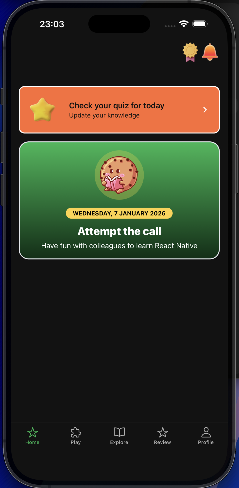
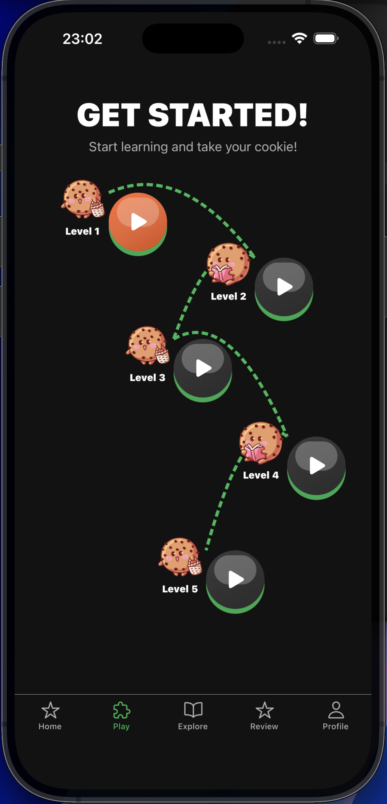
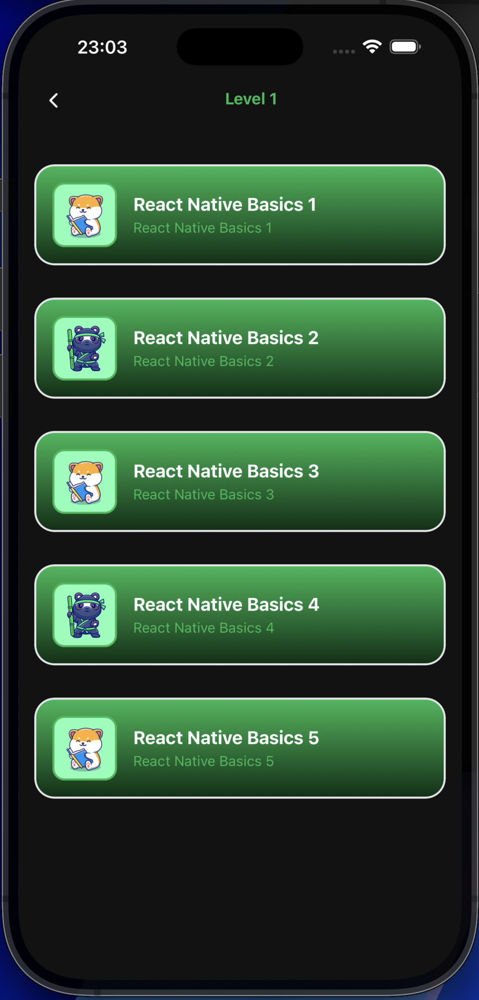
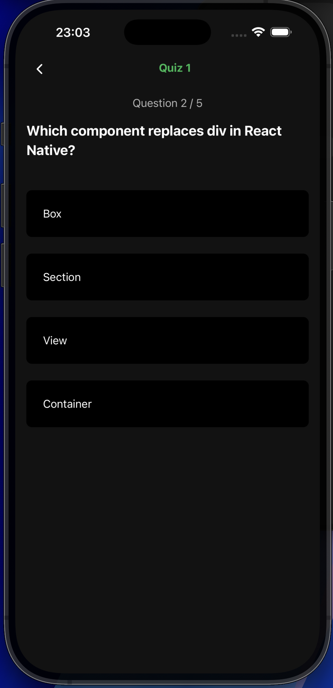

# Learn – Quiz App on React Native / Expo 🎓📱

Welcome to **Learn**, a mobile quiz application built with **React Native**, **Expo**, and **TypeScript**.  
This project is designed for learning and testing React, and React Native concepts through interactive quizzes.

---

## Tech Stack

– **Expo / React Native**
– **TypeScript**
– **Expo Router**
– **Redux Toolkit**
– **Custom Theme System**

## Features

- ✅ Multiple-choice quizzes with categories and difficulty levels (in progress)
- ✅ Progress tracking and results overview (in progress)
- ✅ Smooth and modern UI (in progress)
- ✅ Light and dark theme support (in progress)
- ✅ ESLint + Prettier for consistent code style
- ✅ UI is organized using Atomic Design principles

- Dark and Light theme (in progress)

## Testing (Planned)

- Unit tests for business logic (Vitest)
- Component tests with React Testing Library
- API layer mocks

## 📁 Folder Structure

````text
RN-APP/
├─ app/ # Expo Router entry (routing, layouts)
├─ assets/ # Static assets (images, icons, fonts)
├─ server/ # Backend (Node.js / API layer)
│ ├─ src/
│ ├─ index.ts
│ └─ package.json
│
├─ src/
│ ├─ components/ # Reusable UI components (atomic design)
│ │ ├─ atoms/ # Basic UI primitives (Button, Text, Image)
│ │ ├─ molecules/ # Combined components (LevelPlayButton)
│ │ └─ organisms/ # Feature-level UI blocks
│ │
│ ├─ screens/ # Screen-level components
│ ├─ layouts/ # Shared screen layouts / wrappers
│ │
│ ├─ hooks/ # Reusable hooks (UI & business logic)
│ ├─ context/ # React context providers
│ │
│ ├─ services/
│ │ └─ api/ # API layer (network requests)
│ │ └─ api.ts
│ │
│ ├─ store/ # Global state (Redux Toolkit)
│ │ ├─ slices/
│ │ ├─ selectors/
│ │ └─ store.ts
│ │
│ ├─ theme/ # Design system & theming
│ │ ├─ theme.ts # Colors, spacing, radius, fonts
│ │ ├─ typography.ts # Semantic typography tokens
│ │ ├─ themeProvider.tsx # Theme context & switching
│ │ └─ navigationTheme.tsx
│ │
│ ├─ lib/ # Constants & configs
│ ├─ data/ # Static or mock data
│ ├─ types/ # Global TypeScript types
│ └─ utils/ # Helper functions
│
├─ .env / .env.local # Environment variables
├─ app.config.js # Expo configuration
├─ eslint.config.js
├─ prettier.config.js
├─ tsconfig.json
└─ README.md

---

## Screenshots

| Home Page | Levels | Level quizzes | Quiz |
|---------------|------------|------------|-------|






## Getting Started

### 1. Install dependencies

```bash
npm install
````

### 1. Start the app

```bash
npm start
```

You can open the app on:
Android Emulator (npm run android)
iOS Simulator (npm run ios)
Web (npm run web)
Expo Go (scan the QR code from npm start)

# Local Server – API for Quizzes 🖥️

## 1. Go to the server folder

```bash
cd server
```

## 2. Install dependencies

```bash
npm install
```

## 3. Create a .env.local file

Add your local IP and port for the API:

PORT=3001
BASE_URL=http://192.168.X.X:3001

## 4. Start the server

```bash
npm run start
```
